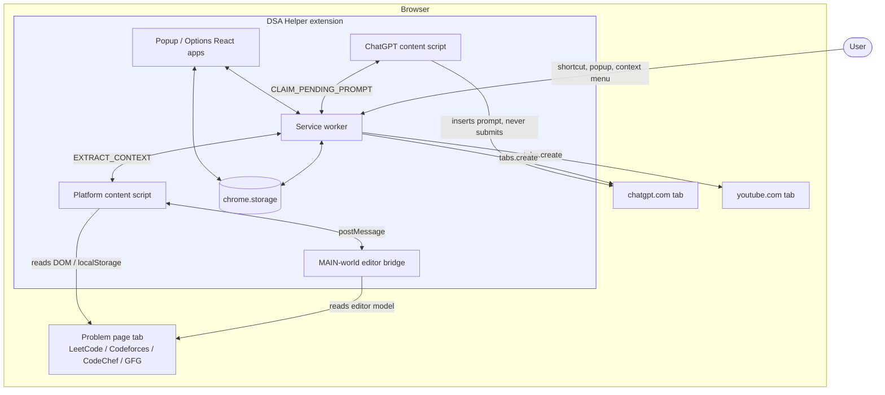
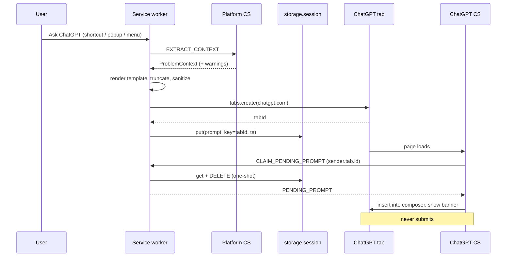

# DSA Helper — Architecture

**Companion to:** [spec.md](spec.md) (what we're building) — this document covers **how it's structured and why**. See also [domain.md](domain.md) for the vocabulary and business rules.
**Version:** 0.1
**Last updated:** 2026-09-01

---

## 1. What "scale" means for this project

The stated goal is to handle a large number of users on the Chrome Web Store. It's worth being precise about what that does and doesn't imply here, because it drives every decision below.

**DSA Helper has no backend.** Every action is local extraction plus a tab navigation the user triggers. There is no server to load-balance, no database to shard, no rate limit to negotiate, no per-request cost. Going from 100 users to 1,000,000 users adds **zero** infrastructure and zero marginal cost.

So scale here is not a capacity problem. It is four different problems:

| At scale, the thing that actually hurts | Architectural answer |
|---|---|
| **Blast radius.** LeetCode ships a redesign; our selector breaks; *100% of users break simultaneously*, and a Web Store review sits between us and the fix (hours to days). | Adapter isolation (§5.2), the degradation ladder (§8.2), and a fast-patch release path (§10.3). No single extraction failure may take down an entire action. |
| **Per-user resource cost.** A wasteful content script is invisible with 10 users and is a 1-star review with 100,000 — it runs on every problem page, on low-end laptops, forever. | Lazy-by-default content scripts and an explicit performance budget (§7). |
| **Support burden.** It grows linearly with users, and we can't reproduce their page state. | Self-service diagnostics + a no-server bug-report path (§10.4). Provenance (`codeSource`, `warnings`) is captured at extraction time precisely so a user's report is actionable. |
| **Trust.** A permissions dialog listing four coding sites plus ChatGPT is the biggest install-funnel drop-off, and one privacy misstep at scale is unrecoverable. | Minimum-permission architecture and a hard no-network stance (§9). |

Everything below optimizes for those four, not for throughput.

---

## 2. Architectural principles

1. **No server, no network calls of our own.** The extension never originates an HTTP request. This is a load-bearing property — it defines the privacy story, the review story, and the cost story. Any future feature that would break it needs an explicit decision (§11.1).
2. **Nothing is trusted except our own code.** Page DOM, page JavaScript, `localStorage` contents, and anything crossing the MAIN-world bridge are hostile input (§9.2).
3. **Degrade, never dead-end.** Every layer has a fallback, and the last fallback is always "put it on the clipboard and tell the user." A user should never press the shortcut and get nothing.
4. **Fail loudly to the user, silently to the console.** Warnings surface in the popup; stack traces stay behind a `DEBUG` flag.
5. **Site-specific knowledge lives in exactly one place per site.** Fixing a LeetCode redesign must never require touching Codeforces code, the prompt builder, or the popup.
6. **The service worker is stateless.** MV3 terminates it after ~30 s idle. Any state that matters is persisted or it doesn't exist (§5.1).
7. **Cheap until asked.** Loading a problem page costs a URL match and an event listener. Extraction happens only on user intent.

---

## 3. System context



**Note what is absent:** no arrow leaves the browser except the two tab navigations the user asked for. That is the whole security and scaling story in one picture.

---

## 4. Component architecture

| Component | Context | Lifetime | Responsibility | Must not |
|---|---|---|---|---|
| **Service worker** (`src/background/`) | Extension | Ephemeral (~30 s idle) | Own all orchestration: commands, context menus, action dispatch, prompt building, tab creation, pending-prompt custody | Hold in-memory state across events; touch the DOM; know site-specific selectors |
| **Platform content script** (`src/content/platform/`) | ISOLATED world, problem tab | Page lifetime | Detect supported page; on request, run the matching adapter and return a `ProblemContext`; render toasts | Build prompts; open tabs; read settings directly |
| **MAIN-world editor bridge** (`src/content/mainworld/`) | MAIN world, problem tab | Page lifetime | One job: read the editor model (Monaco/Ace/CodeMirror) and post it back | Touch `chrome.*` (it has no access); trust anything; do anything but read |
| **ChatGPT content script** (`src/content/chatgpt/`) | ISOLATED world, chatgpt.com | Page lifetime | Claim the pending prompt for its tab, insert it into the composer, show the review banner | Submit the message; run on any host but chatgpt.com |
| **Popup / Options** (`src/popup/`, `src/options/`) | Extension | Per-open | Render state, collect intent, delegate to the service worker | Contain business logic or site knowledge |
| **Core** (`src/core/`) | Shared | — | Pure functions: types, template rendering, `html2md`, storage wrappers, history, redaction | Touch `document` or `chrome.tabs` |

**Dependency rule:** `core` depends on nothing. `background`, `content`, `popup`, `options` all depend on `core` and never on each other. Adapters depend only on `core` + the adapter interface. This keeps `core` unit-testable in plain Node with no browser and no mocks — which is what makes fixture-driven adapter tests (§12) cheap enough to actually maintain.

### 4.1 Why the service worker owns orchestration

The alternative — letting the popup do the work — breaks the moment the trigger is a keyboard shortcut or a context menu, since neither opens a popup. Centralizing means all three trigger surfaces (§9.1 of the spec) converge on one `runAction(actionId, tab)` path, so they cannot drift apart in behavior. The popup becomes a thin renderer.

---

## 5. State architecture

### 5.1 The MV3 ephemerality constraint

The service worker is killed after ~30 seconds of inactivity and restarted cold on the next event. Consequences the design must respect:

- **No module-scope mutable state.** A `let pendingPrompt` at module scope is a bug that only appears under real-world timing — the exact class of defect that is invisible in dev and endemic at scale.
- **Every handler is registered synchronously at top level.** Registering a listener inside an `async` callback loses events after a restart.
- **Handoffs go through storage, not memory.** Hence the pending-prompt design below.

### 5.2 Storage map

| Area | Contents | Limits that matter | Why this area |
|---|---|---|---|
| `chrome.storage.sync` | `Settings` (templates, toggles, theme) | **8 KB per item**, 100 KB total, 120 writes/min | Templates should follow the user across machines. The prompt template can realistically approach 8 KB — see the guard below. |
| `chrome.storage.local` | `HistoryEntry[]`, schema version, last-seen context (for options preview) | 10 MB | History is per-device, disposable, and would burn the sync write quota. |
| `chrome.storage.session` | Pending prompts, keyed by target tab id | 10 MB, in-memory, cleared on browser restart | A prompt containing the user's code must never be written to disk. Session storage is also `TRUSTED_CONTEXTS`-only by default, so content scripts cannot read it — the ChatGPT script must ask the service worker, which is exactly the boundary we want. |

**Sync quota guard.** Before writing settings, the storage layer measures the serialized size of each item. Past ~7 KB it warns in the options UI; past 8 KB the write would throw, so templates are stored split (`promptTemplate` as its own key, never bundled with the rest of `Settings`) and the options page enforces a character cap with a live counter. Write batching/debouncing (500 ms) keeps a user dragging a slider from tripping the per-minute write limit.

### 5.3 Pending-prompt handoff

A refinement of spec §7.2: the pending prompt is keyed **by the tab id of the ChatGPT tab we created**, not stored globally.



Why keyed and one-shot:

- **Isolation.** A user with several problem tabs can fire the action twice in quick succession; a global key would let the second prompt overwrite the first, or the wrong tab claim it. Real users do this constantly.
- **No staleness.** The prompt is deleted on claim, so opening ChatGPT manually an hour later never resurrects an old prompt.
- **Bounded.** Entries carry a timestamp and are swept on `chrome.tabs.onRemoved` and on any claim older than 5 minutes, so an abandoned tab cannot leak the user's code into session memory indefinitely.

**Debounce.** `runAction` is debounced per `(tabId, actionId)` at 750 ms. Holding down the shortcut must not open twenty tabs — a small thing that generates a disproportionate share of support mail.

### 5.4 Schema versioning

Settings and history carry `schemaVersion`. On `chrome.runtime.onInstalled` with `reason: 'update'`, a migration chain runs `v(n) → v(n+1)` in order. This matters far more once published than in development: users skip versions, sync data can arrive from a machine running an older build, and a user whose settings silently reset writes a bad review. Migrations are pure functions in `core/migrations.ts`, unit-tested against captured old-shape fixtures. Unknown-future-version data is left untouched rather than clobbered.

---

## 6. Extraction subsystem

The compatibility surface — 4 platforms × (practice + contest) × continuous redesigns — is the largest maintenance risk in the project, so it gets the most structure.

### 6.1 Adapter registry

```
url ──▶ resolveAdapter(url) ──▶ PlatformAdapter | null
                                      │
                    ┌─────────────────┴─────────────────┐
                    ▼                                   ▼
            extractMeta()                        extractCode()
        (JSON-first, DOM fallback)         (4-layer ladder, §6.4 of spec)
                    │                                   │
                    └──────────────┬────────────────────┘
                                   ▼
                    ProblemContext { …fields, codeSource, warnings }
```

Registry lookup is a pure function over the URL — trivially unit-testable across dozens of real URLs with no browser.

### 6.2 Field-level isolation

`extractMeta()` never runs as one try/catch. **Each field is extracted independently**, wrapped in its own guard:

```ts
const field = <T>(name: string, fn: () => T, warnings: string[]): T | null => {
  try {
    const v = fn();
    if (v == null || v === '') { warnings.push(`Couldn't read ${name}`); return null; }
    return v;
  } catch (e) {
    if (DEBUG) console.warn(`[dsa-helper] ${name}`, e);
    warnings.push(`Couldn't read ${name}`);
    return null;
  }
};
```

This is the single most important decision for surviving at scale. When LeetCode changes its difficulty chip, users lose the word "Medium" from their prompt — they do not lose the action. The blast radius of any one selector is one field.

### 6.3 Selector discipline

- All selectors for a site live in one exported `SELECTORS` object at the top of its adapter, each with a comment recording where it was verified and when.
- **Prefer embedded JSON to DOM.** Page JSON survives visual redesigns; CSS classes do not.
- **Never match hashed CSS-module classes exactly** (GFG's `problems_problem_content__aB3xY`) — match by stable prefix.
- Every selector has at least one fallback in an ordered array; the resolver takes the first that hits and records which one, so diagnostics can report "matched fallback #2" as an early warning that a redesign is underway.

### 6.4 The MAIN-world bridge as a trust boundary

The bridge runs in the page's own JavaScript world, which means **the page can see it, call into it, and forge its replies.** Rules:

- Communication is `window.postMessage` with a namespaced type, a per-page-load random nonce, and an `event.source === window` + origin check on both ends.
- Every response is validated: type-checked, length-capped (256 KB), and treated as an untrusted string.
- The bridge is **read-only**. It never evaluates anything received from the isolated side, so a compromised page gains nothing by talking to it.
- A response is awaited with a 1500 ms timeout; silence falls through to the next extraction layer rather than hanging the action.

---

## 7. Performance budget

Explicit budgets, because these are what turn into reviews.

| Metric | Budget | How it's held |
|---|---|---|
| Content script work on page load | < 5 ms | URL match + listener registration only. No DOM query, no extraction, no observer over the whole document. |
| Added memory per problem tab | < 1 MB | No retained DOM references, no caches. `ProblemContext` is built on demand and released. |
| Extraction latency (warm page) | < 150 ms | Sequential layers, each with a timeout; JSON path avoids traversing large statement DOM. |
| Time from keystroke to tab opening | < 400 ms p95 | Tab creation is not blocked on prompt rendering where avoidable. |
| Bundled extension size | < 500 KB | React only in popup/options (which load on demand). **Content scripts and the service worker ship zero React** — they are plain TypeScript. |
| Service worker wake cost | < 20 ms | No top-level work beyond listener registration; storage reads are lazy. |

**Observer discipline.** SPA navigation detection uses history-API patching plus a debounced observer scoped to `document.querySelector('title')` — *not* a subtree observer on `document.body`. An unscoped observer on these sites fires thousands of times a minute and is the classic way an extension gets blamed for making a site feel slow.

**React boundary.** React is a UI convenience for surfaces the user explicitly opens. Shipping it into every problem page would violate the load-time budget for no benefit, so the build emits separate bundles and the content scripts import nothing from the UI layer.

---

## 8. Resilience and failure model

### 8.1 Failure taxonomy

| Failure | Frequency | Detection | Response |
|---|---|---|---|
| Page not yet hydrated | Common | Anchors absent | Retry backoff 100/300/700/1500 ms |
| One metadata field missing | Common | Field guard | Warning + `null`; prompt marks the section absent |
| Code unreadable (all 4 layers) | Common on Codeforces, occasional elsewhere | `codeSource === 'none'` | Prompt renders a paste placeholder; popup offers "use my selection" |
| Site redesign breaks an adapter wholesale | Rare, high impact | Most fields null | YouTube action falls back to `document.title` + URL; ChatGPT action proceeds with link-only prompt + prominent warning |
| ChatGPT composer not found / insertion rejected | Expected periodically | Read-back verification | Fall back to clipboard + toast: *"prompt copied — press Ctrl+V"* |
| Storage quota exceeded | Rare | Write throws | Surface in options; never lose the user's in-progress edit |
| Service worker killed mid-action | Occasional | — | Every step is restartable; state is in storage |

### 8.2 The degradation ladder

Both user actions are defined as a descent, never a cliff:

```
YouTube:  full context ▸ title+number only ▸ document.title ▸ raw URL slug
ChatGPT:  full prompt  ▸ no code ▸ no statement (link only) ▸ clipboard fallback ▸ toast with reason
```

The user always ends up somewhere useful. Stated as an invariant: **no code path may terminate with the user having pressed a key and nothing having happened.**

### 8.3 Blast-radius containment

Because all users run identical code against sites we don't control, a breakage is global and instantaneous. Containment is structural:

- A failing adapter cannot affect another adapter (separate modules, no shared selector state).
- A failing *field* cannot fail its adapter (§6.2).
- A failing *extraction* cannot fail the action (§8.2).
- A failing *ChatGPT insertion* cannot lose the prompt (clipboard fallback).

The result: the realistic worst case for a LeetCode redesign is degraded prompt quality, not a broken extension — which converts an emergency into a scheduled fix.

---

## 9. Security and privacy architecture

### 9.1 Trust boundaries

```
┌─ Extension (trusted) ──────────────────────────────┐
│  service worker · core · popup · options           │
└──────────────┬─────────────────────────────────────┘
               │ chrome.runtime messaging (validated)
┌──────────────▼─── ISOLATED world (semi-trusted) ───┐
│  platform CS · chatgpt CS                          │
│  our code, but sharing a DOM with a hostile page   │
└──────────────┬─────────────────────────────────────┘
               │ window.postMessage (nonce + origin checked)
┌──────────────▼─── MAIN world / page (UNTRUSTED) ───┐
│  site JS · DOM · localStorage · editor models      │
└────────────────────────────────────────────────────┘
```

Every inbound message is validated against its expected shape before use — including messages that appear to come from our own content scripts, since any page can call `chrome.runtime.sendMessage` if it knows the extension id.

### 9.2 Untrusted content flows into an LLM prompt

Worth naming explicitly: problem statements are attacker-controllable in principle (user-authored content exists on these platforms), and that text is placed into a prompt the user sends to ChatGPT. Mitigations:

- Extracted content is **fenced and labeled** in the prompt as quoted problem material, not as instructions.
- Markdown fences in extracted content are escaped so a statement cannot close our code block and inject sibling instructions.
- Length caps bound how much foreign text can enter.
- Crucially, **we never auto-submit** — the user reads the prompt before sending. The human review step is a security control, not just a UX preference.

### 9.3 Permissions posture

Least privilege, and each permission maps to one justification for Web Store review:

| Permission | Why | Alternative rejected |
|---|---|---|
| `storage` | Settings, history, prompt handoff | — |
| `activeTab` + `scripting` | Injection and on-demand execution | `<all_urls>` — rejected outright |
| `contextMenus` | Right-click trigger | — |
| `tabs` | Create tabs, correlate the pending prompt to a tab id | `activeTab` alone can't give us the created tab id |
| 5 platform hosts + `chatgpt.com` | The extension's entire function | See below |

**Optional host permissions** are a considered alternative: declare the platform hosts in `optional_host_permissions` and request on first use per site. It improves the install-funnel conversion (the install dialog gets quieter) and the privacy story, at the cost of a first-run grant flow. **Decision: keep them required in v1** — the extension is inert without them, and a confusing first-run grant is worse than an honest install dialog. Revisit if install conversion proves to be a problem (§13).

### 9.4 Hard rules

- No remotely hosted code, ever (MV3 policy, and a `content_security_policy` that forbids it).
- No `eval`, no `innerHTML` with page-derived strings; toasts and banners build DOM nodes with `textContent` inside a shadow root.
- No analytics, no telemetry, no network requests. The privacy policy is a paragraph because the architecture makes it true.
- The user's code is treated as sensitive: session storage only, deleted on claim, never written to `local` or `sync`, never included in any diagnostic export without explicit redaction consent (§10.4).

---

## 10. Operating at scale

### 10.1 What scales for free

No servers, no accounts, no quotas of ours, no per-user cost. Chrome Web Store CDN handles distribution. 1M users cost exactly what 100 do.

### 10.2 What doesn't

Compatibility maintenance and support. Both are addressed structurally rather than by adding infrastructure.

### 10.3 Release strategy

- **Staged rollout.** Use the Web Store's percentage rollout for every release. A bad adapter change reaching 5% of users is a bug report; reaching 100% is a reputational event.
- **Fast-patch path.** Adapter fixes are isolated by design (§5 of principles), so a selector hotfix touches one file and needs no other regression surface. Keep a release branch that can ship a selector-only patch within an hour of diagnosis, review time notwithstanding.
- **Compatibility fixtures gate the release.** Adapter tests run on saved HTML fixtures in CI (§12); a fixture refresh that fails is an early warning before users see it.
- **Version pinning of expectations.** Each adapter records the date its selectors were last verified. Anything older than ~90 days is a review candidate.

### 10.4 Support at scale, without a backend

- **Diagnostics panel** in options: runs the resolver + adapter against the current tab and shows a field-by-field report (which selector matched, which fallback, what failed). Most "it's broken" reports become self-diagnosing.
- **"Report a broken page"** builds a redacted diagnostic blob — URL pattern, extension version, Chrome version, per-field success/failure, selector-fallback indices, **never the statement text and never the user's code** — copies it to the clipboard, and opens a prefilled issue template. Zero infrastructure, and it scales to any number of users.
- **Known-breakage notice.** If an adapter reports total failure, the popup shows a single line pointing at the issue tracker, which deflects duplicate reports during the window between a redesign and our patch.

### 10.5 A note on remote selector configuration

The tempting fix for blast radius is fetching selectors from a remote JSON file so a breakage can be patched without review. **Not in v1**, for two reasons: it introduces the first network call and breaks the "nothing leaves the browser" property that the entire privacy and review posture rests on; and remotely delivered behavior sits close enough to the Web Store's remote-code prohibition that it invites review friction. If blast radius ever proves intolerable in practice, revisit it explicitly as a separate decision, with the config strictly data (selector strings only, schema-validated, signed, bundled fallback always present) — and update the privacy policy honestly.

---

## 11. Extensibility seams

| Seam | Adding one means | Touches |
|---|---|---|
| `PlatformAdapter` | New site (e.g. HackerRank, AtCoder) | 1 new file + 1 manifest match + fixtures |
| `DestinationAdapter` | New AI target (Claude, Gemini) | 1 new file + 1 content script match + a settings picker |
| Template variables | New prompt data | `core/templates.ts` + docs |
| Trigger surfaces | New entry point | `background/actions.ts` only — all surfaces already converge there |

### 11.1 Explicitly deferred

Anything requiring a backend: sync beyond `storage.sync`, usage analytics, shared prompt libraries, a "solutions seen by others" feature. Each would invert principle 1 of §2 and turn a zero-cost extension into an operational service with per-user cost, a real privacy policy, and a security surface. Not a no — a decision that must be made deliberately rather than arrived at.

---

## 12. Testing architecture

| Layer | Tool | What it covers |
|---|---|---|
| Unit | Vitest, plain Node | `core/`: template rendering (incl. empty-variable collapsing), `html2md`, truncation order, migrations, redaction, URL resolver |
| Adapter | Vitest + jsdom + saved HTML fixtures | Each adapter against real captured pages: practice + contest, per platform |
| Contract | Vitest | Message-shape validation; every `Msg` variant round-trips |
| Manual smoke matrix | Checklist in the repo | 4 platforms × 2 page kinds × 3 trigger surfaces × 3 actions, per release |

**Fixtures are the highest-value test asset here.** Capture them at M2 and refresh them on a schedule — they are the only mechanism that detects a site redesign before users do. Keep them as trimmed HTML (statement region + editor region), with any account-identifying markup scrubbed.

---

## 13. Risk register

| Risk | Impact | Likelihood | Mitigation | Residual |
|---|---|---|---|---|
| ChatGPT composer redesign breaks insertion | High — the flagship feature | **High** (they ship often) | Read-back verification + 3 insertion strategies + clipboard fallback | Accepted: users get a one-step paste until patched |
| LeetCode/CodeChef/GFG SPA redesign | Medium | High | Field isolation, JSON-first, fallback selector arrays, fixtures | Degraded prompt quality, not breakage |
| Code extraction returns partial buffer (virtualized editor) | Medium — a wrong review from truncated code is worse than no review | Medium | Layer ordering puts full-buffer sources first; DOM scrape is explicitly warned about in the prompt *and* the popup | Accepted, with disclosure |
| Web Store review rejects host permissions | High — blocks launch | Low | One justification per permission, no remote code, no network, minimal scope | — |
| Sync quota exceeded by a long prompt template | Low | Medium | Split keys, size guard, live counter | — |
| MV3 worker termination mid-flow | Low | Medium | Stateless handlers, storage-based handoff | — |
| Prompt injection via problem statement | Low | Low | Fenced/labeled/escaped content, length caps, **no auto-submit** | — |
| Users treat the tool as a contest cheat | Reputational | Medium | No special handling by decision; stated plainly in README and listing so the choice is informed | Accepted per product decision |

---

## 14. Architectural decision summary

| # | Decision | Chief reason |
|---|---|---|
| A1 | No backend, no network calls | Zero marginal cost at any scale; makes the privacy claim structurally true |
| A2 | Service worker owns all orchestration | Three trigger surfaces cannot drift; MV3-safe |
| A3 | Per-field extraction isolation | Converts a global outage into a missing word |
| A4 | Per-tab, one-shot, session-scoped prompt handoff | Multi-tab correctness; the user's code never touches disk |
| A5 | React confined to popup/options | Keeps the per-page cost near zero for every user, forever |
| A6 | MAIN-world bridge is read-only and nonce-checked | The page is hostile; the bridge lives in its world |
| A7 | Never auto-submit to ChatGPT | Human review is both the UX intent and a security control |
| A8 | Required (not optional) host permissions in v1 | Extension is inert without them; honest dialog beats confusing grant flow |
| A9 | Staged rollout + fixture-gated releases | The only real defense against a simultaneous global breakage |
| A10 | Diagnostics + clipboard bug reports instead of telemetry | Support scales linearly without inverting A1 |
