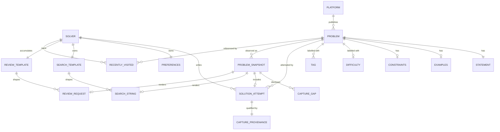

# DSA Helper — Domain Model

**Companions:** [spec.md](spec.md) (source of product requirements) · [architecture.md](architecture.md) (context only)
**Version:** 0.1
**Last updated:** 2026-09-02

## How to read this document

This describes **what the words mean and which rules hold**, independently of how anything is built. It contains no selectors, no storage APIs, no message shapes, no file layout. Where a domain concept has a corresponding technical name in the spec, that name is noted in parentheses once, purely so the two documents can be reconciled — the technical detail itself stays in `spec.md`.

Two flags are used throughout, and they mean different things:

- **[UNDETERMINED]** — the documents do not answer this. Not an omission on purpose; a real gap that needs a product answer before code depends on it.
- **[NEEDS DECISION]** — the documents answer it *inconsistently*, or a choice is implied but never made.

Nothing in this document is invented. Every rule cites the spec section it comes from, or carries a flag.

**As of this version all twelve originally-flagged questions have been answered** (§11). The flags stay defined because new gaps will appear as the product grows.

---

## 1. The problem space

A person practising data-structures-and-algorithms works inside a **judge platform** — a site that hosts problems, accepts code, and judges it. The practice loop is: read a problem, form an approach, write code, run it, and either pass or get stuck.

Getting stuck has two shapes, and the domain exists to serve exactly those two:

1. **"I don't understand the problem or the technique."** The practitioner wants an *explanation from a human* — conventionally a video walkthrough. The domain answer is a **video search**, phrased so the results are about this specific problem.
2. **"I wrote something and I don't know if it's right, or good."** The practitioner wants a *review of their own attempt*. The domain answer is an **AI review request**: the problem, their code, and a clear statement of what feedback they want.

Both are **hand-offs**. The domain's job ends when the practitioner arrives at the other service with a well-formed question. It does not answer the question, judge the code, or store the work (spec §1, Non-goals).

The value being created is the removal of clerical work — retyping the problem name, copying the statement, pasting the code, and re-explaining what kind of feedback is wanted — at the exact moment the practitioner is stuck and least willing to do it.

---

## 2. Actors and roles

There is **one human role**. This is a single-user, single-actor domain: no accounts, no sharing, no collaboration, no administration, no author or moderator role (spec §1, Non-goals).

| Actor | Kind | Role in the domain |
|---|---|---|
| **Solver** | Human, the only human role | Reads problems, writes attempts, decides when help is wanted, decides what is finally sent. Owns all templates, preferences, and history. |
| **Judge Platform** | External system | The **system of record** for a problem: its identity, statement, examples, constraints, difficulty, and tags. Authoritative — the domain only ever reads and reports what the platform says. LeetCode, Codeforces, CodeChef, GeeksforGeeks (spec §3). |
| **Video Corpus** | External system | An unaffiliated body of explanatory videos, reached by search. YouTube (spec §7.1). |
| **AI Reviewer** | External system | An unaffiliated conversational assistant that receives a review request. ChatGPT in v1 (spec §2). |
| **The Helper** | The system being built | A **broker**. Observes the problem the Solver is on, assembles a well-formed request, and hands it over. Never an author, never a judge, never a sender. |

**Role boundaries that matter:**

- The Helper never acts as the Solver toward the AI Reviewer. Composing is the Helper's; **sending is exclusively the Solver's** (spec §7.2).
- The Judge Platform is authoritative for problem facts; the Helper never corrects, normalises, or supplements them.
- The Solver's relationships with the Judge Platform and the AI Reviewer (their accounts, their terms of service, their contest obligations) are **outside this domain** and unmediated by it.

---

## 3. Ubiquitous language

### 3.1 One name for one thing — **resolved**

The spec originally used **"problem"** and **"question"** interchangeably for a single concept — "problem page" and "problem statement" alongside "question details", "recent questions", and a central `QuestionContext`.

**Decision: "Problem", everywhere.** All four Platforms use it (LeetCode "Problems", Codeforces "problemset", CodeChef "problems", GFG "problems"), and *question* is ambiguous in this domain — the Solver also asks a *question* of the AI Reviewer, which is a different thing entirely.

"Question" is now a **retired term**. It appears in no document, no identifier, and no user-facing string. The rename has been applied across `spec.md` and `architecture.md` (`QuestionContext` became `ProblemContext`, "Recent questions" became "Recent problems").

### 3.2 Glossary

| Term | Means | Explicitly does **not** mean |
|---|---|---|
| **Platform** | One of the four judge sites the domain understands (spec §3) | Any coding site generally; unsupported sites have no domain presence |
| **Problem** | A single algorithmic task published by a Platform, identified by that Platform | A page; a URL; a topic |
| **Practice Problem** | A Problem reachable outside a contest context (spec §3) | — |
| **Contest Problem** | A Problem reachable within a contest context (spec §3). Treated identically to Practice in every rule (spec §11) | A *live* contest specifically — live and archived are deliberately not distinguished (**R21**) |
| **Statement** | The prose describing the task | Examples or constraints, which are separate where separable (spec §5) |
| **Examples** | Sample inputs and outputs published with the Problem | Test cases the Solver wrote |
| **Constraints** | The published bounds on input size and value ranges | Complexity requirements the Solver inferred |
| **Difficulty** | The Platform's own difficulty expression, recorded verbatim (spec §5) | A comparable score — see **R11** |
| **Tags** | Topic labels the Platform publishes, often hidden until revealed (spec §5) | Labels the Solver applied |
| **Problem Identifier** | Whatever the Platform uses to name the Problem — see §5 | A single universal scheme |
| **Solution Attempt** | The Solver's **current, in-progress code** for this Problem, in one language | An accepted submission; a submission history; a saved solution |
| **Capture Provenance** | How trustworthy the captured Solution Attempt is (see §7.2) | Where the code came from technically |
| **Capture Gap** | A fact the Helper could not read, recorded and disclosed (spec §5, `warnings`) | An error; the Solver is not at fault and nothing is broken |
| **Problem Snapshot** | Everything the Helper knows about one Problem at one instant, including the Solution Attempt and any Capture Gaps (spec: `ProblemContext`) | A durable record — it is point-in-time and discarded |
| **Search Template / Review Template** | Solver-owned patterns that turn a Snapshot into a Search String or Review Request (spec §7.1, §8) | Fixed system text |
| **Search String** | The rendered query handed to the Video Corpus | — |
| **Review Request** | The rendered text handed to the AI Reviewer: Problem facts + Solution Attempt + the feedback the Solver wants (spec §8) | A message that has been sent |
| **Help Action** | One of exactly three things the Solver can ask for: video search, AI review, or take-the-request-elsewhere (spec §2) | — |
| **Recently Visited Problem** | A lightweight record that the Solver was on a Problem (spec §5, `HistoryEntry`) | A record of what was asked or sent |
| **Inaccessible Problem** | A Problem the Solver is not entitled to read — paywalled or login-gated (spec §6.6) | A Capture Gap; nothing failed, and the Helper is working correctly (**R25**) |

---

## 4. Entities and relationships



**Cardinality notes with domain meaning:**

- A Problem has **many** Snapshots over time; a Snapshot belongs to exactly one Problem and one instant. Snapshots are never merged or compared — the Helper has no concept of "the problem changed".
- A Snapshot **may** include a Solution Attempt, and may not (spec §6.4, `codeSource: 'none'`).
- A Problem may have **many** Solution Attempts in principle — one per language the Solver has opened. Exactly one is *the* Solution Attempt: the language **currently open in the editor** (**R18**).
- Templates are **singletons per Solver**: one Search Template, one Review Template (spec §5 `Settings`). There is no library, no per-platform variant, no named preset.
- Recently Visited references a Problem but carries **no** Statement and **no** Solution Attempt (spec §5, `HistoryEntry` fields).

---

## 5. Platform variation — the core domain complexity

This is where the domain is genuinely hard: four Platforms with **incompatible models** of the same concepts. Any code or reasoning that assumes uniformity here is wrong.

| Concept | LeetCode | Codeforces | CodeChef | GeeksforGeeks |
|---|---|---|---|---|
| **Identifier the Solver uses** | Slug + a public number (`912`) (spec §6.3) | Contest id + index, combined (`1352A`) (spec §6.3) | Problem code (`FLOW001`) (spec §3) | Slug only (spec §3) |
| **Has a separate "number"?** | Yes | Yes, but it *is* the identifier | No — the code is the identifier | **No** — spec §7.1 explicitly anticipates a rendered string with no number |
| **Difficulty expression** | Words: Easy / Medium / Hard | A numeric rating: `1200` (spec §5, §6.3) | Platform's own chip (spec §6.3) | Words: Easy / Medium / Hard |
| **Contest form** | Contest problems (spec §3) | Contest **and** Gym problems (spec §3) | Contest problems (spec §3) | Practice only in v1 (spec §3) |
| **Solution Attempt available on the problem page?** | Yes | **No — no editor exists on the problem page** (spec §3, §6.4) | Yes | Yes |
| **Public identifier ≠ internal identifier** | Yes — the public number is not the platform's internal id (spec §6.3) | — | — | — |

**The three traps this table exists to prevent:**

1. **"Number" is not one concept.** It is a public sequence number, a composite contest reference, a mnemonic code, or absent. Treating it as an optional integer is wrong; treating its absence as an error is wrong (spec §7.1).
2. **Difficulty is not one scale.** `Medium` and `1200` are not comparable and never convert. See **R11**.
3. **A Solution Attempt is not always obtainable.** On Codeforces it is normally absent by the platform's design, not by failure (spec §6.4). Any rule reading "the Solver's code" must tolerate its absence as a *normal* state.

---

## 6. Business rules

Each rule cites its origin. Rules marked *(derived)* follow necessarily from the cited material but are not stated in those words.

### Availability and scope

- **R1** — Help Actions are available only on a recognised Problem of a supported Platform. Asking for help elsewhere produces an explanation, never silence. *(spec §3, §9.1)*
- **R2** — Contest Problems are subject to **exactly the same rules** as Practice Problems. No restriction, no warning, no differing behaviour. The ethical position is disclosed to the Solver in writing, and the choice is theirs. *(spec §11)*
- **R3** — Exactly one AI Reviewer exists in v1. The Solver cannot choose a destination. *(spec §2)*

### Authorship and consent

- **R4** — **The Solver sends; the Helper never does.** A Review Request is always presented for review, never transmitted on the Solver's behalf. *(spec §7.2)*
- **R5** — The Solution Attempt is read-only to the Helper. It is never modified, submitted, or persisted beyond the moment of use. *(spec §1 Non-goals; architecture context)*
- **R6** — Nothing leaves the browser except navigations the Solver triggered. *(spec §10)*

### Honesty about what was captured

- **R7** — A Capture Gap must be **disclosed, not hidden**. An absent Statement, absent Examples, or absent Solution Attempt is stated explicitly in the Review Request rather than rendered as emptiness, so the AI Reviewer is not misled into treating an omission as a fact. *(spec §5, §8)*
- **R8** — Every captured Solution Attempt carries its Capture Provenance, and that provenance is shown to the Solver. Where the capture may be **incomplete**, the Solver is told so — because a review of truncated code is worse than no review. *(spec §5, §6.4)*
- **R9** — A Help Action never dead-ends. Reduced information degrades the result; it never cancels it. *(spec §2; architecture §8.2 as context)*

### Composition

- **R10** — When a Review Request exceeds its size limit, the **Statement is sacrificed first, Examples second, and the Solver's own code never**. The Solver's work is the one irreducible part of the request. *(spec §7.2)*
- **R11** — Difficulty is recorded and presented **verbatim as the Platform expresses it**. It is never normalised, converted, ranked, or compared across Platforms. *(derived from spec §5, where a single field holds both `Medium` and `1200`)*
- **R12** — A Search String is derived from a Template only. There is no per-Problem editing before the search runs; the Solver adjusts the Template, or edits at the Video Corpus after arriving. *(spec §7.1)*
- **R13** — The Solver may exclude their code from the Review Request entirely. *(spec §5, `includeCode`)*

### Solver-owned configuration

- **R14** — Both Templates are owned by the Solver: freely editable, and always restorable to the shipped default. *(spec §2, §8)*
- **R15** — Recently Visited is capped at a Solver-chosen limit, clearable, and **disableable entirely** (a limit of zero). *(spec §5, §9.4)*
- **R16** — Recently Visited records **identity only** — Platform, title, identifier, link, and when. It never contains a Statement and never contains a Solution Attempt. *(derived from spec §5, `HistoryEntry` field list)*
- **R17** — The Solver may **pause** recording without clearing what is already recorded and without changing the limit. Pausing is a separate act from disabling. *(spec §9.2, §9.4)*
- **R18** — Templates are **copyable by the Solver**, so a crafted Review Template can outlive the Helper's removal. *(spec §9.4)*

### Identity

- **R19** — A Problem's identity is **(Platform, Problem Identifier)** and never its address. Every address that leads to one Problem denotes that one Problem. *(spec §5.1)*
- **R20** — Recently Visited holds **one record per Problem**. Returning to a Problem refreshes that record and moves it to the front; it never creates a second one. *(spec §5.1)*

### Fidelity of what is relayed

- **R21** — Of several Solution Attempts, the one in the language **currently open** is *the* Solution Attempt. What the Solver is looking at is what is relayed. *(spec §6.4)*
- **R22** — Mathematical notation is relayed **verbatim**, never approximated. Constraints expressed as mathematics are precisely the part a review must not get wrong. *(spec §6.5)*
- **R23** — A figure that cannot be relayed is **named in its absence**, never dropped in silence. This is **R7** applied to content that is present but untransportable. *(spec §6.5)*
- **R24** — A Statement is relayed in the language the Platform published it in. The Helper neither detects nor translates. *(spec §6.5)*

### Entitlement

- **R25** — A Problem the Solver is **not entitled to read** is a named condition, distinct from a Capture Gap and never presented as a fault. Both Help Actions remain available: the Problem's name is normally still known, and a video explanation is *more* valuable when the Statement cannot be read, not less. *(spec §6.6)*
- **R26** — Live and archived contests are **not distinguished**. The Helper does not determine whether a contest is running, and behaves identically either way. *(spec §11)*

---

## 7. States and transitions

### 7.1 Problem recognition

```
Unrecognised ──(Solver navigates to a supported Problem)──▶ Recognised
Recognised ──(Solver requests help)──▶ Observed
Observed ──▶ { Fully Observed | Partially Observed }
Recognised ──(Solver navigates away)──▶ Unrecognised
```

- **Unrecognised** — no Problem is in view. Help Actions are unavailable; Recently Visited remains available (spec §9.2).
- **Recognised** — a supported Problem is in view. Help is offered. No facts have been read yet; recognition is cheap and does not imply knowledge.
- **Observed** — a Snapshot exists. It is **always** one of:
  - **Fully Observed** — no Capture Gaps.
  - **Partially Observed** — one or more Capture Gaps, disclosed. **This is a normal, expected, first-class state, not a failure** (spec §11, §6.4).
  - **Inaccessible** — the Solver is not entitled to read this Problem (spec §6.6). Distinct from Partially Observed: nothing failed, and saying so is the whole point (**R25**).

Recognition and observation are separate on purpose: the Helper knows *that* a Problem is present long before it knows *what* the Problem says.

### 7.2 Solution Attempt capture

Provenance is a **trust ordering**, from most to least trustworthy:

| State | Meaning | Trustworthy? |
|---|---|---|
| **Authoritative** | The Solver's complete working buffer was obtained | Yes — complete |
| **Possibly Partial** | Only what was visibly rendered could be read; content may be missing | **No — must be disclosed** (spec §6.4) |
| **Solver-Supplied** | The Solver selected the text themselves | Yes — the Solver chose it |
| **Excluded** | The Solver turned code off | N/A — absent by intent (spec §5) |
| **Absent** | Nothing was obtainable. Normal on Codeforces (spec §6.4) | N/A — absent by circumstance |

The domain rule that makes this ordering matter is **R8**: *Possibly Partial* must never be presented as if it were *Authoritative*.

### 7.3 Review Request lifecycle

```
Composed ──▶ Handed Off ──▶ Presented for Review ──▶ ??? (unobservable)
                  │
                  └──(hand-off fails)──▶ Diverted (given to the Solver to carry)
```

- **Composed** — rendered from Snapshot + Template.
- **Handed Off** — delivered toward the AI Reviewer.
- **Presented for Review** — visible to the Solver, **awaiting their decision**. This is the terminal state *the domain can observe.*
- **Diverted** — hand-off did not succeed, so the request is placed in the Solver's hands to carry across manually (spec §7.2, §7.3). Also reachable directly, as a first-class Help Action (spec §2).

**A defining property of this domain:** what happens after *Presented* — sent, edited then sent, or abandoned — is **outside the system's knowledge**. The Helper cannot and does not observe whether the Solver ever sent the request, and holds no notion of a "conversation", a "reply", or an "answer". The domain ends at the hand-off.

A Review Request is **single-use**: once presented, it is consumed and not retained *(architecture context; the domain-meaningful part is that a request is never reused or resurrected later)*.

---

## 8. Invariants

Properties that must hold at all times. A violation is a defect regardless of what any feature says.

- **I1** — A Snapshot guarantees only its **Platform** and its **link**. Every other fact is optional. Any consumer that requires a title, a number, a Statement, or code is wrong.
- **I2** — A Snapshot's disclosed Capture Gaps always match its actually-missing facts. Silent omission is a defect; so is a warning about something that was captured fine.
- **I3** — A Solution Attempt is never present without its Provenance.
- **I4** — The Solver's code is never truncated by the Helper (**R10**), never altered, and never persisted.
- **I5** — Code reaches a third party only through an action the Solver took **in that destination** — sending in the AI Reviewer, or pasting what they were handed.
- **I6** — Problem identity is (**Platform**, **Problem Identifier**). Titles are not identity: titles repeat across Platforms and change over time.
- **I7** — A Difficulty value is meaningful **only** within its own Platform.
- **I8** — Recently Visited contains no Statements and no code (**R16**).
- **I9** — Every Help Action reaches a terminal state the Solver can perceive: a result, or an explanation of why not (**R9**).

---

## 9. Permissions and consent

There is **no permission model in the usual sense** — no roles, no ownership hierarchy, no access control, no sharing, no multi-tenancy. It is worth stating plainly, because an absent model is easily mistaken for an unspecified one.

What exists instead:

| Consent | Granted by | Covers | Revoked by |
|---|---|---|---|
| **Observation consent** | The Solver, at install | Permission to read the four Platforms' pages and to place text at the AI Reviewer (spec §10) | Removing the Helper, which erases everything it holds (spec §9.4) |
| **Per-request consent** | The Solver, per Help Action | This specific Snapshot becoming this specific request | Not proceeding |
| **Send consent** | The Solver, in the AI Reviewer itself | The request actually being transmitted (**R4**) | Not sending; the request is simply abandoned |

The Solver has unconditional authority over everything the domain holds: templates, preferences, and history are theirs to edit, reset, or erase. Nothing is withheld from them and nothing is shared beyond them.

**Out of scope:** the Solver's own standing with the Platforms and the AI Reviewer — logins, subscriptions, contest eligibility, and the terms they have separately agreed to. The domain neither models nor enforces any of it.

---

## 10. Domain constraints

Facts about the world that bound what is possible, regardless of design.

1. **The Platforms are not partners.** They publish no interface for this purpose, owe no stability, and can change at any time without notice. Every fact the domain holds is an *observation*, never a contract.
2. **A Snapshot is instantaneous and perishable.** It reflects one moment. The Solver edits their code continuously; a Snapshot taken a minute ago may already misrepresent it. The domain holds **no** notion of freshness, staleness, or re-validation.
3. **Absence is normal, not exceptional.** Given §5, a design that treats missing facts as errors would spend most of its life in an error state.
4. **Contest integrity is a real obligation the Helper does not enforce.** Using AI assistance during a live contest violates the Platforms' rules. The product decision is to inform rather than restrict (spec §11), which places the obligation entirely on the Solver.
5. **Third-party content is relayed to a third party.** Statements are the Platforms' published content, and the domain's core act is placing that content — with the Solver's code — into another company's service. The project's stated position: it automates a copy-paste the Solver could perform by hand, content moves only on an explicit Solver action, nothing is stored or redistributed, and the Solver's own agreements with each Platform continue to bind them. Published in the README and the store listing (spec §11).
6. **The Video Corpus is unaffiliated and unverified.** A Search String produces *results*, not answers. The domain makes no claim that any result concerns the Problem, is correct, or exists at all.
7. **Only one attempt exists at a time.** No versions, no history of attempts, no diffing between them.

---

## 11. Resolved domain questions

Twelve questions the source documents left open, each now answered. Recorded with its consequence, because the consequence is the part that binds future work.

| # | Question | Answer | Consequence |
|---|---|---|---|
| **U1** | Problem or question? | **Problem**, everywhere | "Question" is retired. Rename applied across all documents (§3.1) |
| **U2** | Is one Problem at several addresses one thing, and how does history behave? | Identity is (Platform, Identifier); one record per Problem, moved to front on return | **R19**, **R20** |
| **U3** | Which language is *the* attempt? | The one currently open in the editor | **R21**. No picker, no timestamps, no ambiguity |
| **U4** | Mathematics and figures? | Mathematics verbatim; figures named as absent | **R22**, **R23**. Bounds review quality honestly rather than silently |
| **U5** | Non-English Statements? | Relayed unchanged; no detection, no translation | **R24**. A response-language preference belongs in the Solver's template |
| **U6** | Problems the Solver cannot read? | A named condition of its own, not a fault; both actions stay available | **R25**, plus the *Inaccessible* state in §7.1 |
| **U7** | Live vs archived contests? | Not distinguished | **R26**. No liveness detection anywhere; the README states the position instead |
| **U8** | Relaying Platform content to an AI service? | A stated position in the README and listing | §10.5. Automates a manual copy-paste; the Solver's own agreements still bind them |
| **U9** | Are mirrored Problems across Platforms related? | No | **I6** holds unchanged. Identity never crosses Platforms |
| **U10** | What survives the Helper's removal? | Nothing — but Templates are copyable | **R18**. The Solver can preserve what they authored |
| **U11** | Finer history control? | A pause, separate from the limit and from clearing | **R17** |
| **U12** | Multi-part, interactive, subtask Problems? | No special modelling | One Problem, one Statement, one Attempt. Subtasks, follow-ups and interaction protocols are prose *inside* the Statement, and the AI Reviewer reads them as such |

**Two of these deserve re-examination once real usage exists.** *U4* caps how good a review can be for figure-heavy problems, and the placeholder only makes the ceiling visible rather than raising it. *U6* depends on detecting a paywall reliably; if that detection proves fragile, the fallback is the ordinary Capture Gap, which is a degradation rather than a break.

---

## 12. Traceability

| Source | Contributes |
|---|---|
| `spec.md` §1–§3 | Problem space, actors, supported Platforms, scope |
| `spec.md` §5 | Entity attributes, optionality, history contents, Solver preferences |
| `spec.md` §6 | Platform variation, Capture Provenance ordering, absence as normal |
| `spec.md` §7–§8 | Help Actions, composition rules, truncation priority, disclosure of gaps |
| `spec.md` §9–§11 | Availability, consent surfaces, the contest position |
| `architecture.md` | Context only — informed §7.3 (single-use requests) and §9 (consent boundaries). No architecture is restated here |
| Product decisions, 2026-09-02 | §11 in full, and rules **R17-R26** which follow from those answers |
